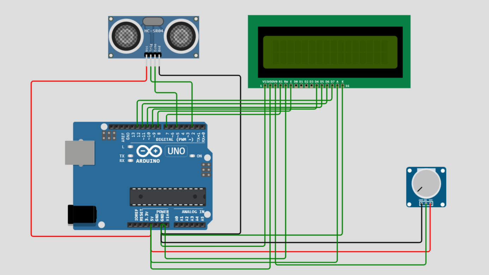

# Workshop Resources: SONAR


[Online IoT simulation platform](https://wokwi.com/)

```C:
#include<LiquidCrystal.h>

int rs=7;
int en=8;
int d4=9;
int d5=10;
int d6=11;
int d7=12;

LiquidCrystal lcd(rs,en,d4,d5,d6,d7);

int trigPin = 2;
int echoPin = 5;
int pingTravelTime;
int numMeas = 70;
int i;
int dt = 500;
float distance;
float finalDist;

void setup() {
  lcd.begin(16,2);
  pinMode(trigPin,OUTPUT);
  pinMode(echoPin,INPUT);
  //Serial.begin(9600);
}

void loop() {
  finalDist = 0;

  // for finding the average value and with good accuracy
  for(i = 1;i <= numMeas;i++){
    // to create and send the wave by HC-SR04
    digitalWrite(trigPin,LOW);
    delayMicroseconds(10);
    digitalWrite(trigPin,HIGH);
    delayMicroseconds(10);
    digitalWrite(trigPin,LOW);

    // measures the time taken by wave to go and come back
    pingTravelTime=pulseIn(echoPin,HIGH);

    // finding distance between Sensor and object in cm
    // speed of sound in air is 343 m/s
    distance = 34300*((pingTravelTime*0.000001)/2.00);

    // adding the value for numMeas measurements
    finalDist = finalDist + distance;
  }
  
  // finally taking average value for better accuracy
  finalDist = finalDist/(numMeas*1.00);

  // clearing the screen
  lcd.clear();

  // first row
  lcd.setCursor(0,0);
  lcd.print("Distance is : ");

  //second row
  lcd.setCursor(0,1);
  lcd.print(finalDist);
  lcd.print(" cm ");

  delay(dt);

  //Serial.print("Distance is : ");
  //Serial.println(distance);

}

```
